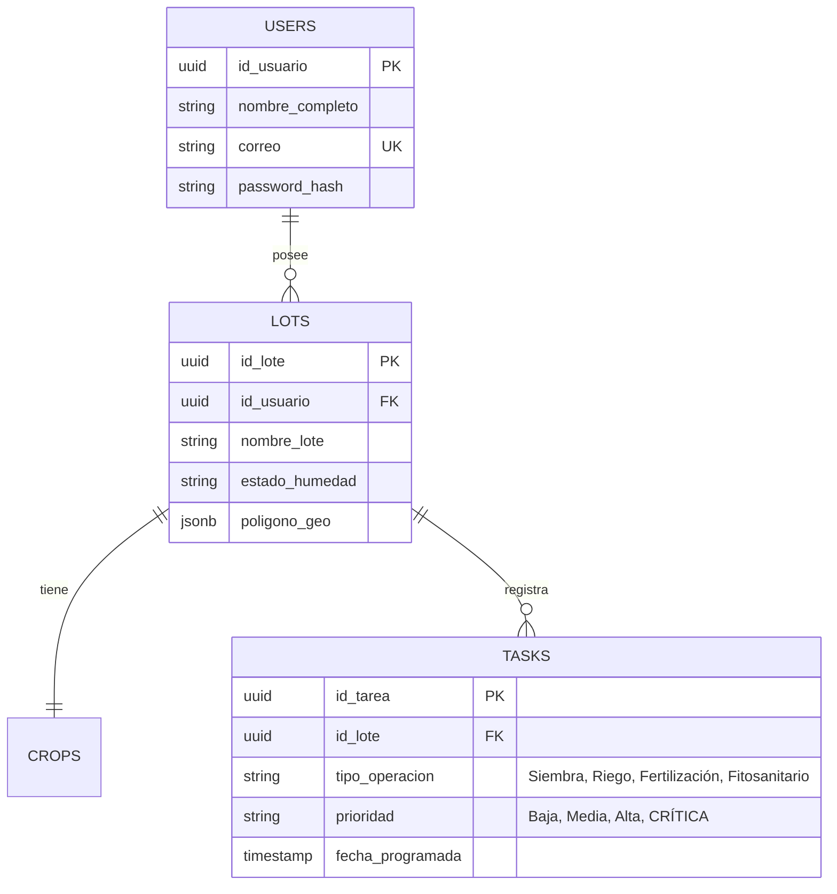

# Smart Farming 🌾

**Smart Farming** es una solución tecnológica diseñada para la gestión eficiente de cultivos, permitiendo a los pequeños productores monitorear el estado del suelo y recibir alertas críticas, incluso en zonas con conectividad limitada. Este proyecto es desarrollado por estudiantes de Ingeniería de Sistemas de la **Universidad del Magdalena**.

## 🚀 Características Principales

- **Gestión Offline**: Capacidad de registrar datos y consultar tareas sin conexión a internet, sincronizando automáticamente al recuperar la señal.
- **Dashboard de Control**: Visualización inmediata de la próxima tarea pendiente y alertas críticas de plagas.
- **Mapeo de Lotes**: Registro geográfico de terrenos para recomendaciones personalizadas de riego y fertilización.
- **Monitoreo del Suelo**: Seguimiento en tiempo real de niveles de humedad y nutrientes (Nitrógeno).
- **Diseño Rugged/Neo-brutalista**: Interfaz de alta visibilidad y contraste, optimizada para el trabajo en campo.

## 🛠️ Stack Tecnológico

- **Frontend**: Flutter & Dart (Arquitectura modular y componentes personalizados).
- **Backend**: Node.js (API REST).
- **Base de Datos**:
  - **PostgreSQL**: Almacenamiento centralizado con soporte geoespacial.
  - **SQLite**: Persistencia local en el dispositivo móvil para modo offline.
- **Infraestructura**: AWS / Google Cloud Platform.

## 📁 Estructura del Proyecto (Frontend)

```text
lib/
├── core/
│   └── theme/          # Definición de colores y estilos visuales (Rugged)
├── presentation/
│   ├── screens/        # Vistas principales (Login, Home, MapOnboarding)
│   └── widgets/        # Componentes reutilizables (CustomAppBar, RuggedCards)
└── main.dart           # Punto de entrada de la aplicación
```

## 👥 Equipo de Desarrollo

Estudiante de Ingeniería de Sistemas - Universidad del Magdalena.

Ana Karina Rivera
Andres Rivera
Yuranis Botto
Camila Castaño
Jesus Capataz

## 🔧 Instalación y Configuración

1. Clonar el repositorio:
    ```text
    git clone https://github.com/AnaKarina15/smart-farming-app.git
    ```

2.  Instalar dependencias:
    ```bash
    flutter pub get
    ```
3.  Ejecutar la aplicación:
    ```bash
    flutter run
    ```

## 🗄️ Modelo de Base de Datos (MER)

El sistema utiliza una arquitectura de base de datos híbrida: **PostgreSQL** para el almacenamiento centralizado en la nube y **SQLite** para la gestión de datos en modo offline dentro del dispositivo móvil.

### Diagrama de Relaciones



## Descripción de Módulos

Módulo de Siembra: Planificación de fechas de plantación y seguimiento del ciclo de vida inicial del cultivo.

Módulo de Riego: Monitoreo de niveles de humedad y programación de frecuencias de irrigación.

Módulo de Fertilización: Seguimiento de nutrientes (Nitrógeno, Fósforo, Potasio) y planes de abonado.

Módulo Fitosanitario: Gestión de alertas de plagas, enfermedades y registro de tratamientos químicos o biológicos.
